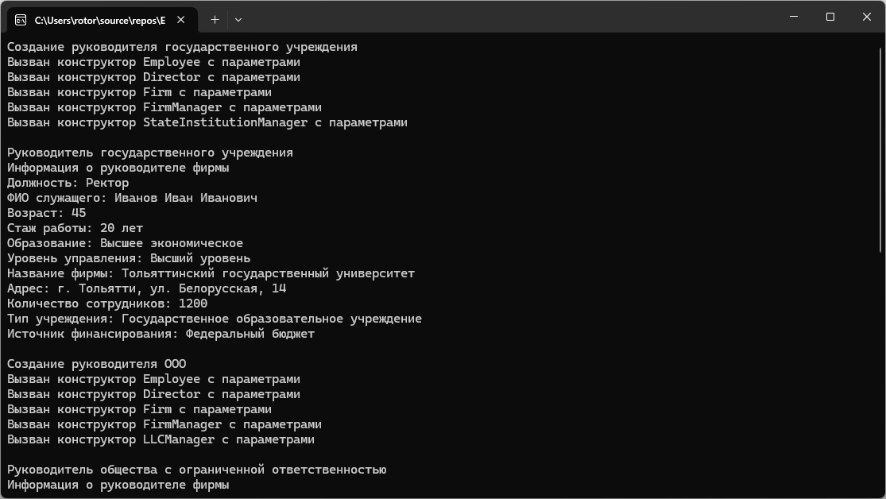

# Модуль 2. Задание 6. Вариант 2
Практическая работа по объектно-ориентированному программированию.

## Возможности программы
- создание базового класса Employee;
- создание производного класса Director;
- создание класса Firm;
- использование множественного наследования;
- создание класса FirmManager на основе Director и Firm;
- создание классов StateInstitutionManager и LLCManager;
- вывод информации о фирме и руководителе;
- демонстрация работы конструкторов, конструктора копирования и деструктора.

## Пример работы программы

