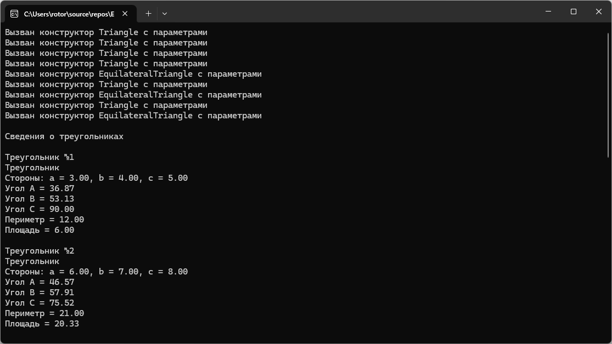

# Модуль 2. Задание 5. Вариант 2
Практическая работа по объектно-ориентированному программированию.

## Возможности программы
- создание базового класса Triangle;
- создание производного класса EquilateralTriangle;
- использование одиночного наследования;
- проверка существования треугольника;
- вычисление углов треугольника;
- вычисление периметра и площади;
- поиск средней площади обычных треугольников;
- поиск наибольшего равностороннего треугольника.

## Пример работы программы

