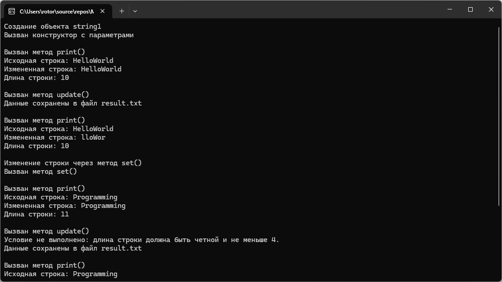

# Модуль 2. Задание 3. Вариант 2
Практическая работа по объектно-ориентированному программированию.

## Возможности программы
- создание строк с использованием конструкторов;
- работа с динамической памятью;
- изменение строки согласно условию варианта;
- сохранение исходной и измененной строки в файл;
- использование конструктора копирования;
- вывод информации о вызове методов и деструктора.

## Пример работы программы

