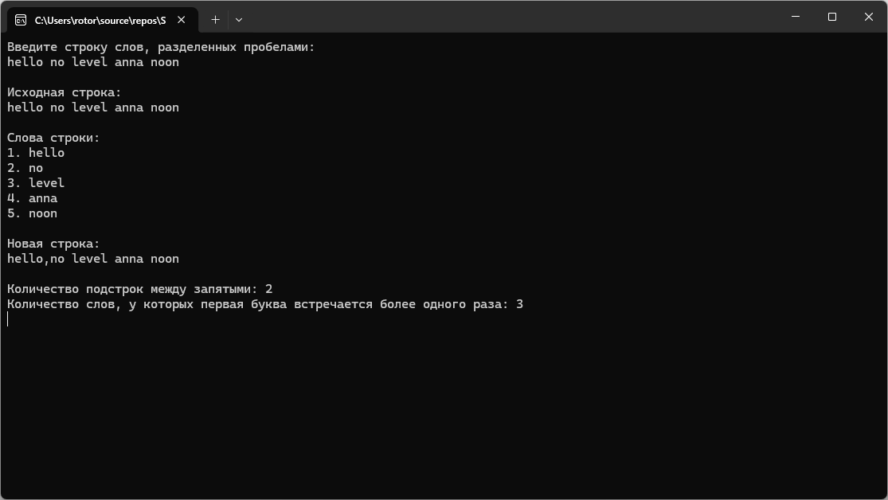

# Модуль 3. Задание 1. Вариант 2
Практическая работа по объектно-ориентированному программированию.

## Возможности программы
- ввод строки слов, разделенных пробелами;
- разбиение строки на отдельные слова;
- формирование новой строки с запятой перед каждым словом no;
- подсчет количества подстрок между запятыми;
- определение количества слов, у которых первая буква встречается более одного раза;
- использование стандартной библиотеки C++.

## Пример работы программы

