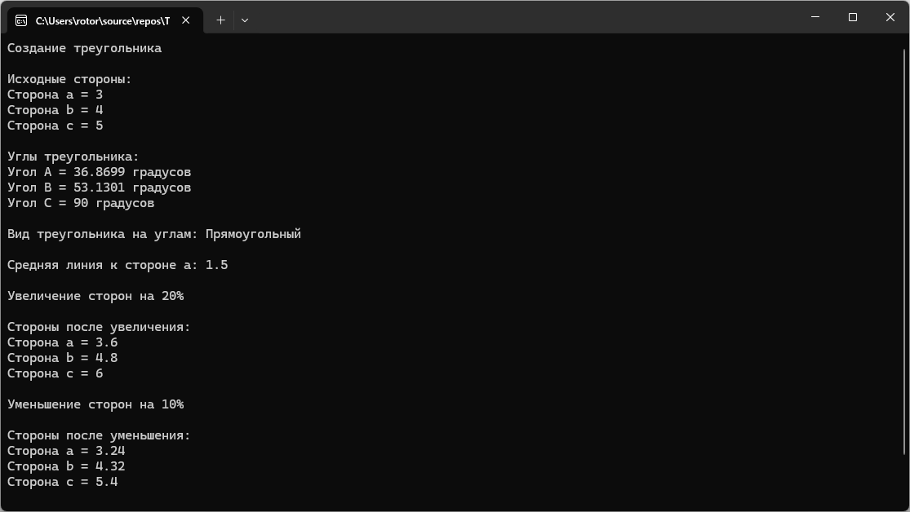

# Модуль 2. Задание 2. Вариант 2
Практическая работа по объектно-ориентированному программированию.

## Возможности программы
- изменение размеров сторон;
- вычисление средней линии;
- определение углов;
- определение типа треугольника.

## Пример работы программы

