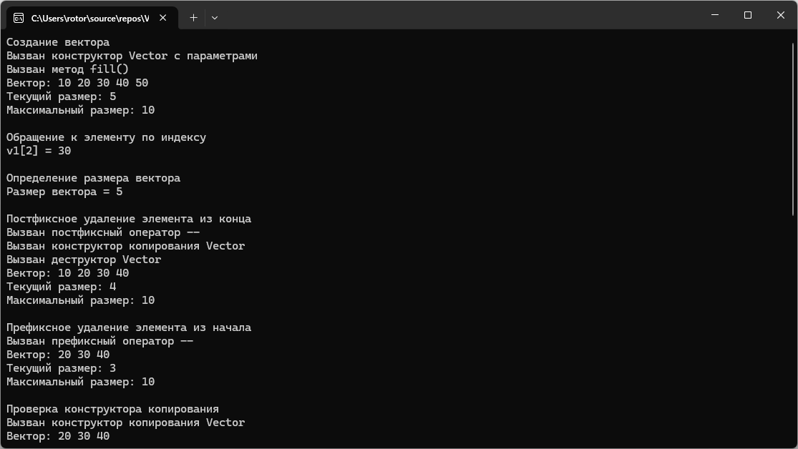

# Модуль 2. Задание 7. Вариант 4
Практическая работа по объектно-ориентированному программированию.

## Возможности программы
- создание класса-контейнера Vector;
- хранение элементов типа int;
- перегрузка оператора доступа по индексу [];
- перегрузка оператора определения размера ();
- перегрузка префиксного оператора --;
- перегрузка постфиксного оператора --;
- удаление элемента из начала вектора;
- удаление элемента из конца вектора;
- генерация и обработка исключительных ситуаций.

## Пример работы программы

